# spec-ai Architecture Diagram

## Component Overview

```mermaid
graph TB
    subgraph "User Interface"
        CLI["CLI/REPL<br/>(src/cli)"]
        Spec["Agent Spec<br/>(TOML)"]
    end

    subgraph "Configuration & Registry"
        Config["AppConfig<br/>ModelConfig<br/>AgentProfile<br/>(src/config)"]
        AgentReg["Agent Registry<br/>(Named Profiles)"]
        ToolReg["Tool Registry<br/>(Available Tools)"]
        PluginReg["Plugin Registry<br/>(Bootstrap)"]
    end

    subgraph "Core Execution Engine"
        AgentCore["AgentCore<br/>Execution Loop<br/>(src/agent/core)"]
        ModelFactory["Model Factory<br/>(src/agent/factory)"]
    end

    subgraph "Model Providers"
        OpenAI["OpenAI"]
        Anthropic["Anthropic<br/>Claude"]
        LMStudio["LM Studio"]
        MLX["MLX"]
        Ollama["Ollama"]
    end

    subgraph "Tool System"
        ToolTrait["Tool Trait<br/>(Interface)"]
        subgraph "Built-in Tools"
            FileOps["File Operations<br/>(read, write, extract)"]
            Bash["Bash/Shell<br/>Execution"]
            WebTools["Web Search<br/>Web Scraper"]
            Graph["Graph Operations<br/>(Knowledge Graph)"]
            Audio["Audio<br/>Transcription"]
            Other["Calculator<br/>Echo<br/>Prompt"]
        end
    end

    subgraph "Knowledge & Memory"
        Embeddings["Embeddings Service<br/>(src/embeddings)"]
        Graph_DB["Knowledge Graph<br/>GraphNode<br/>GraphEdge<br/>(Types)"]
    end

    subgraph "Persistence Layer"
        DB["DuckDB<br/>(src/persistence)"]
        Messages["Messages Table"]
        MemVectors["Memory Vectors<br/>Embeddings"]
        ToolLogs["Tool Logs"]
        GraphTables["Graph Nodes<br/>Graph Edges"]
        PolicyCache["Policy Cache"]
    end

    subgraph "Access Control"
        Policy["Policy Engine<br/>(src/policy)<br/>Allow/Deny Rules"]
    end

    subgraph "Analysis & Discovery"
        Bootstrap["Bootstrap Self<br/>(src/bootstrap_self)"]
        subgraph "Plugins"
            CargoPlugin["Cargo Plugin<br/>(Rust)"]
            ToakPlugin["TOAK Tokenizer<br/>Plugin"]
            UniversalPlugin["Universal Code<br/>Plugin"]
        end
    end

    subgraph "Output"
        AgentOutput["AgentOutput<br/>Response + Metadata"]
    end

    %% Main flows
    CLI -->|Commands| CliState["CliState<br/>(State Manager)"]
    Spec -->|Load| CliState

    CliState -->|Initialize| AgentCore
    CliState -->|Get Profile| AgentReg
    AgentReg -->|Uses| Config

    AgentCore -->|Select Provider| ModelFactory
    ModelFactory -->|Create| OpenAI
    ModelFactory -->|Create| Anthropic
    ModelFactory -->|Create| LMStudio
    ModelFactory -->|Create| MLX
    ModelFactory -->|Create| Ollama

    AgentCore -->|Get Tools| ToolReg
    ToolReg -->|Contains| ToolTrait
    ToolTrait -->|Implemented by| FileOps
    ToolTrait -->|Implemented by| Bash
    ToolTrait -->|Implemented by| WebTools
    ToolTrait -->|Implemented by| Graph
    ToolTrait -->|Implemented by| Audio
    ToolTrait -->|Implemented by| Other

    AgentCore -->|Retrieve Memory| Embeddings
    Embeddings -->|Query| MemVectors
    Embeddings -->|Query| Graph_DB

    AgentCore -->|Check Permission| Policy
    Policy -->|Query| PolicyCache

    AgentCore -->|Load/Save| DB
    DB -->|Store| Messages
    DB -->|Store| MemVectors
    DB -->|Store| ToolLogs
    DB -->|Store| GraphTables
    DB -->|Store| PolicyCache

    AgentCore -->|Execute| FileOps
    AgentCore -->|Execute| Bash
    AgentCore -->|Execute| WebTools
    AgentCore -->|Execute| Graph
    AgentCore -->|Execute| Audio
    AgentCore -->|Execute| Other

    FileOps -->|Results| ToolLogs
    Bash -->|Results| ToolLogs
    WebTools -->|Results| ToolLogs
    Graph -->|Results| ToolLogs
    Audio -->|Results| ToolLogs
    Other -->|Results| ToolLogs

    Bootstrap -->|Use| PluginReg
    PluginReg -->|Load| CargoPlugin
    PluginReg -->|Load| ToakPlugin
    PluginReg -->|Load| UniversalPlugin
    Bootstrap -->|Create Nodes/Edges| GraphTables

    AgentCore -->|Produces| AgentOutput

    style AgentCore fill:#ff6b6b
    style DB fill:#4ecdc4
    style Policy fill:#ffe66d
    style Embeddings fill:#95e1d3
    style Bootstrap fill:#c7ceea
```

## Key Components

### User Interface
- **CLI/REPL**: Command-line interface for interactive agent control
- **Agent Spec**: TOML-based declarative specifications for structured execution

### Configuration & Registry
- **AppConfig**: Global application settings (database, logging, UI, audio)
- **Agent Registry**: Named agent profiles with per-agent settings
- **Tool Registry**: Available tools with execution implementations
- **Plugin Registry**: Bootstrap plugins for codebase analysis

### Core Execution Engine
- **AgentCore**: Main execution loop orchestrating the entire agent workflow
- **Model Factory**: Creates appropriate model provider instances

### Model Providers
Multi-provider support:
- OpenAI (GPT-4, etc.)
- Anthropic (Claude)
- LM Studio (local models)
- MLX (Apple Silicon optimization)
- Ollama (open-source models)

### Tool System
**Tool Trait**: Extensible interface for tools

**Built-in Tools**:
- **File Operations**: read, write, extract
- **Bash/Shell**: Command execution
- **Web Tools**: Search, scraping
- **Graph Operations**: Knowledge graph queries
- **Audio**: Transcription
- **Utilities**: Calculator, echo, prompt

### Knowledge & Memory
- **Embeddings Service**: Vector generation for semantic search
- **Knowledge Graph**: GraphNodes and GraphEdges for relationship tracking

### Persistence Layer (DuckDB)
- **Messages**: Conversation history
- **Memory Vectors**: Embeddings for semantic search
- **Tool Logs**: Execution records
- **Graph Tables**: Knowledge graph entities and relationships
- **Policy Cache**: Authorization rules

### Access Control
- **Policy Engine**: Evaluates Allow/Deny rules for tool execution based on (agent, action, resource) tuples

### Analysis & Discovery
- **Bootstrap Self**: Codebase self-discovery system
- **Plugins**: Modular analysis for specific languages
  - Cargo Plugin (Rust projects)
  - TOAK Tokenizer (code tokenization)
  - Universal Code Plugin (generic code analysis)

## Data Flow

1. **Initialization**:
   - CLI loads configuration
   - Agent profile selected from registry
   - AgentCore initialized with tools and model provider

2. **Execution Loop**:
   - Retrieve semantic memory via embeddings
   - Query knowledge graph for context
   - Call model with context and available tools
   - Parse model response for tool calls
   - Check policy engine for permissions
   - Execute authorized tools
   - Log results to persistence
   - Add to conversation history
   - Repeat until goal satisfied

3. **Persistence**:
   - All state saved to DuckDB
   - Messages, vectors, logs, graph data, policies stored
   - Enables agent continuity across sessions

4. **Knowledge Building**:
   - Tool results and messages analyzed for entities and relationships
   - GraphNodes created for discovered concepts
   - GraphEdges created for relationships
   - Embeddings generated for semantic recall