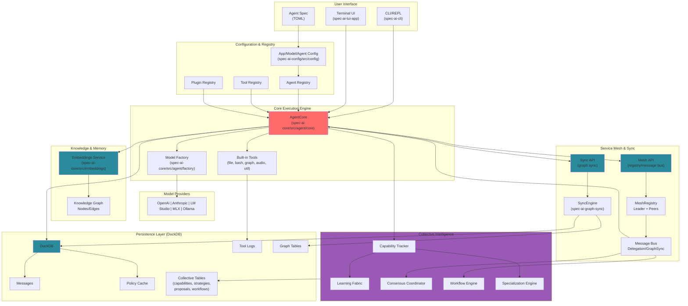

# spec-ai Architecture Diagram

## Component Overview

## Key Components

### User Interface
- **CLI/REPL** (`spec-ai-cli`): Command-line interface for interactive agent control
- **Terminal UI** (`spec-ai-tui-app`): Full-featured interactive terminal application built on the `spec-ai-tui` framework
- **Agent Spec**: TOML-based declarative specifications for structured execution

### Configuration & Registry
- **AppConfig**: Global application settings (database, logging, UI, audio)
- **Agent Registry**: Named agent profiles with per-agent settings
- **Tool Registry**: Available tools with execution implementations
- **Plugin Registry**: Bootstrap plugins for codebase analysis

### Core Execution Engine
- **AgentCore**: Main execution loop orchestrating the entire agent workflow
- **Model Factory**: Creates appropriate model provider instances

### Model Providers
Multi-provider support:
- OpenAI (GPT-4, etc.)
- Anthropic (Claude)
- LM Studio (local models)
- MLX (Apple Silicon optimization)
- Ollama (open-source models)

### Tool System
**Tool Trait**: Extensible interface for tools

**Built-in Tools**:
- **File Operations**: read, write, extract
- **Bash/Shell**: Command execution
- **Web Tools**: Search, scraping
- **Graph Operations**: Knowledge graph queries
- **Audio**: Transcription
- **Utilities**: Calculator, echo, prompt

### Knowledge & Memory
- **Embeddings Service**: Vector generation for semantic search
- **Knowledge Graph** (`spec-ai-knowledge-graph`): Isolated crate for graph storage, vector clocks, and graph types (GraphNodes, GraphEdges) for relationship tracking

### Terminal UI Framework
- **spec-ai-tui**: Low-level TUI framework built from scratch on crossterm, providing geometry primitives, cell-based buffer rendering, constraint-based layout, widget system, and async event loop
- **spec-ai-tui-app**: Interactive terminal application using the TUI framework, with chat interface, backend integration, and Elm-inspired state management

### Distributed Coordination & Sync
- **Mesh Registry & Messaging**: Agents register, exchange heartbeats, and route inter-agent messages (task delegation, notifications, sync triggers) via the mesh API and tooling (`crates/spec-ai-api/src/api/mesh.rs`, `crates/spec-ai-core/src/tools/builtin/mesh_communication.rs`).
- **Graph Sync Pipeline** (`spec-ai-graph-sync`): Vector-clock negotiation chooses full vs incremental graph exchange; conflict resolution merges concurrent edits before persisting. Key modules: `engine.rs`, `protocol.rs`, `resolver.rs`.
- **State Persistence**: Sync state, changelog, tombstones, and vector clocks are stored alongside graph data in DuckDB (`crates/spec-ai-config/src/persistence`).

### Collective Intelligence (`spec-ai-collective`)
Emergent multi-agent coordination enabling agents to learn from each other and develop specializations.

- **Capability Tracking**: Agents track proficiency per domain using EMA-based updates. The `CapabilityTracker` routes tasks to the most capable agent.
- **Task Delegation**: `DelegationManager` handles task routing, delegation chains, and result aggregation across the mesh.
- **Learning Fabric**: Agents share successful strategies. Strategies include approach steps and semantic embeddings for similarity-based discovery.
- **Consensus Coordinator**: Expertise-weighted voting on proposals (strategy adoption, policy changes, resource allocation, conflict resolution).
- **Workflow Engine**: Multi-agent workflow orchestration with Sequential, Parallel, MapReduce, Consensus, and ConditionalBranch stage types.
- **Specialization Engine**: Detects emergent specialists, identifies capability gaps, and routes queries to domain experts.

See [`docs/COLLECTIVE_INTELLIGENCE.md`](COLLECTIVE.md) for detailed documentation.

### Persistence Layer (DuckDB)
- **Messages**: Conversation history
- **Memory Vectors**: Embeddings for semantic search
- **Tool Logs**: Execution records
- **Graph Tables**: Knowledge graph entities and relationships
- **Policy Cache**: Authorization rules

### Access Control
- **Policy Engine**: Evaluates Allow/Deny rules for tool execution based on (agent, action, resource) tuples

### Analysis & Discovery
- **Bootstrap Self**: Codebase self-discovery system
- **Plugins**: Modular analysis for specific languages
  - Cargo Plugin (Rust projects)
  - TOAK Tokenizer (code tokenization)
  - Universal Code Plugin (generic code analysis)

## Data Flow

1. **Initialization**:
   - CLI or TUI loads configuration
   - Agent profile selected from registry
   - AgentCore initialized with tools and model provider

2. **Execution Loop**:
   - Retrieve semantic memory via embeddings
   - Query knowledge graph for context
   - Call model with context and available tools
   - Parse model response for tool calls
   - Check policy engine for permissions
   - Execute authorized tools
   - Log results to persistence
   - Add to conversation history
   - Repeat until goal satisfied

3. **Persistence**:
   - All state saved to DuckDB
   - Messages, vectors, logs, graph data, policies stored
   - Enables agent continuity across sessions

4. **Knowledge Building**:
   - Tool results and messages analyzed for entities and relationships
   - GraphNodes created for discovered concepts
   - GraphEdges created for relationships
   - Embeddings generated for semantic recall
